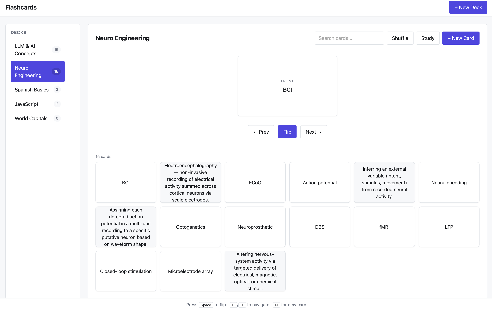

# Flashcards App

A keyboard-friendly flashcards app built with plain HTML, CSS, and JavaScript — no build step. Decks and cards persist to `localStorage`; a Study mode handles flip / prev / next / shuffle with keyboard shortcuts.

## Run

Open `index.html` directly, or serve the folder:

```
python3 -m http.server 8000
```

Then visit <http://localhost:8000>.

## Files

- `index.html` — markup (header, sidebar, main, footer, modals)
- `styles.css` — tokens, layout, components, dark mode, reduced-motion
- `app.js` — state, CRUD, rendering, study mode, search
- `storage.js` — `loadState` / `saveState` with versioning and safe parse

## Keyboard shortcuts (Study mode)

- `Space` — flip current card
- `←` / `→` — previous / next card
- `N` — new card
- `Esc` — exit study mode

## Screenshot



## Reflection

#### **Where AI saved time.** 
Scaffolding the tricky plumbing — accessible modal with focus trap, 3D CSS flip, `storage.js` with version check + safe parse, and the two seed decks (LLM & AI, Neuro Engineering). Minutes of directed generation instead of hours of hand-coding.

#### **AI bug I caught and fixed.** 
- **Issue**: Added a new "LLM & AI Concepts" seed deck to `SEED_DECKS`, but after closing and re-opening `index.html` the new deck still didn't appear in the browser. 

- **Root cause**: `hydrateFromStorage` was unconditionally replacing `state.decks` with whatever was in `localStorage` — and that snapshot, saved before I added d4, contained only `[d1, d2, d3]`, so d4 from `SEED_DECKS` was discarded on every load.

- **Fix**: merge seeds on hydrate. I added a persisted `seededIds` set; on each load the app loops through `SEED_DECKS` and, for any id not already in `seededIds`, clones the seed into state and marks it seeded, then `persist()` writes the merged result back.

After the fix, on the next reload with a pre-existing localStorage (decks d1–d3 saved, no `seededIds` yet):
  - `hydrateFromStorage` loads the stored decks into state.
  - `seededIds` defaults to empty (old data had no such field).
  - It loops through `SEED_DECKS`: d1–d3 are marked seeded in-place without duplicating; d4 (LLM & AI Concepts) is missing, so it's cloned into state.
  - `persist()` writes the merged state back with `seededIds: [d1, d2, d3, d4]`.

Going forward, any new seed deck I add to `SEED_DECKS` auto-appears on the next page load. Decks the user deletes aren't resurrected — their id stays in `seededIds`.

#### **One accessibility improvement.** 
The study flashcard was originally a `<div tabindex="0">` with no name. 
I converted it to `<button aria-pressed>` with a dynamic `aria-label` that announces position + visible face + text — *"Card 3 of 15, front: Hola. Activate to flip."* — and toggle `aria-hidden` on the non-visible face so screen readers only see the side currently showing.

#### **Prompt changes that improved AI output.** 
Framing each step as a three-part audit — **Completion check** → **AI inconsistency watch** → **Quality checks** — forced the model to self-audit against a checklist instead of declaring "done" after writing the code. That pattern caught the missing shuffle handler, the focus-trap asymmetry (only `Shift+Tab` recovered when focus escaped), and the silently-failing whitespace edits. Specifying concrete edge cases (case-sensitive search, trim behavior) also prevented lazy defaults.
